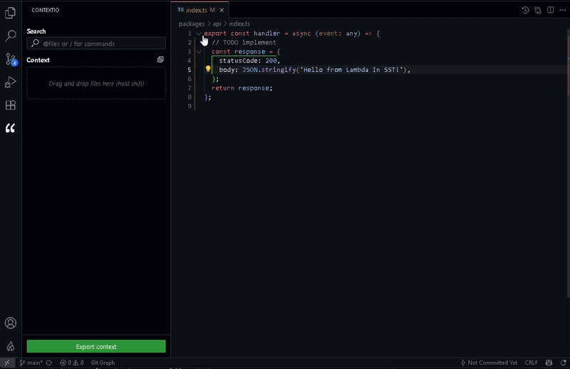

# contextio

simple extension for managing and exporting code context for LLMs, directly within VS Code

## why?

in my company I work with LLMs directly from web interface, doing copy and paste of files on browser is annoying. This extension provides a simple interface in VS Code to quickly gather files, see the total context size, and export everything to the clipboard in a clean, formatted way with system prompt and preamble.

## features

- **quick search:** Use the `@` prefix (e.g., `@service.ts`)
- **command palette:** Use the `/` prefix like `/opentabs` to add all currently active editor tabs
- **drag and drop:** hust drag files from the explorer (hold `shift`) and drop them into the panel
- **context summary:** get a real-time summary of your context
- **export:** copy all file paths and their content to your clipboard, ready to be pasted into any LLM chat

## demo

## next

- git integration
- smart token counting via model-specific tokenizers (`tiktoken`)
- respect .gitignore
- custom system prompt
